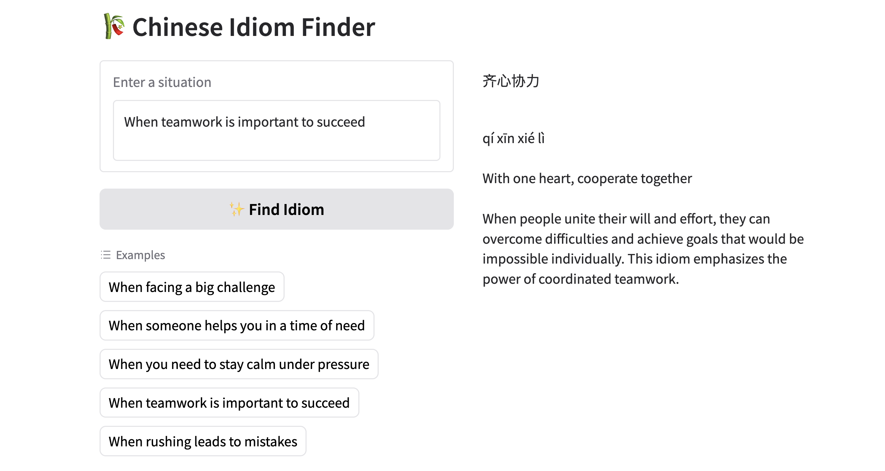

# 🀄 Chinese Idiom Finder  

A Large Language Model (LLM)-powered interactive app for exploring and learning **Chinese idioms (成语, 俗语, 谚语)**.  
When a user provides a situation in English, the app suggests a relevant idiom, provides **pinyin**, a **literal English translation**, and a **concise explanation**.  

---

## ✨ Features  
- 🔍 **Idiom search** powered by an LLM (**gpt-oss-120b**) running on Cerebras’s AI inference platform. This model was chosen for its strong performance and availability on the Cerebras Free tier.
- ✅ **Idiom verification** using:  
  - [ChID dataset](https://arxiv.org/abs/1906.01265) (Chinese Idiom Dataset)  
  - CC-CEDICT (open Chinese–English dictionary)  
  - Wiktionary 

---

## 🚀 How It Works  
1. User inputs a situation (e.g. *“When teamwork is important to succeed”*).  
2. The LLM generates an idiom suggestion.  
3. The idiom is verified against datasets/dictionaries before it's returned.



---

## 🛠️ Tech Stack  
- [Gradio](https://www.gradio.app/) (frontend)  
- Hugging Face Spaces (deployment)  
- Cerebras LLM API  
- Python (requests, pypinyin, etc.)  

---

## 🖥️ Local Development  

Clone the repo and run locally:  

```bash
git clone https://huggingface.co/spaces/chinese-enthusiasts/idiom-finder
cd idiom-finder
pip install -r requirements.txt
python app.py
```
